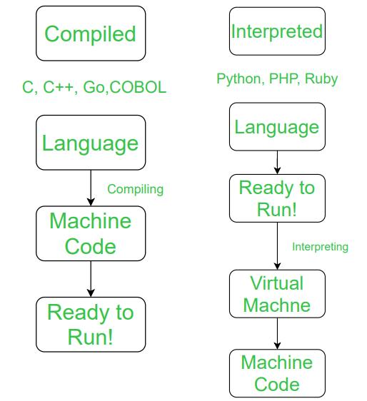
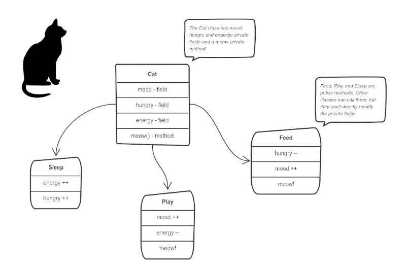

# Table of Contents

1.  [Python como lenguaje de programación](#orgae593a7)
    1.  [Qué es Python?](#orgd997996)
        1.  [Interpretado](#org021fbd5)
        2.  [Orientado a Objetos](#org75ce896)
        3.  [Lenguaje de alto nivel](#org4289997)
    2.  [Ventajas y desventajas de Python](#org2275689)
    3.  [Probando instalación de Python](#org445ea5d)
2.  [Python Básico](#org1f098c3)
    1.  [Tipos de variables/datos](#org174adc6)
        1.  [Introducción](#orgd19b23c)
        2.  [Strings](#org26dae31)
        3.  [Tipos numéricos](#orgb4c9258)
        4.  [Tipos secuencia](#org3ee69e3)
        5.  [Conjuntos](#org88b48ac)
        6.  [Tipo Mapa](#orgbd8d079)
        7.  [Otros tipos](#orga4e3ab3)
    2.  [Asignando variables](#org67c9d4c)

# Python como lenguaje de programación

## Qué es Python?

`Python` es un lenguaje de programación que es simple, con una sintáxis fácil
de aprender y que se centra en que el código sea fácil de leer.

### Interpretado

Un lenguaje interpretado que usa un **interprete** para ser ejecutado.

### Orientado a Objetos

Programación Orientado a Objetos (OOP) es un paradigma de programación
que se basa en el concepto de **clases** y **objetos**. Estos son usados para
estructurar en bloques de código simples y reusables.

### Lenguaje de alto nivel

Se dice **alto nivel** dado que algunos pasos para ejecutar el programa en el
procesador han sido **removidos**. Es decir, los códigos de alto nivel contienen
sintáxis facil de leer que será convertida a un lenguaje de **bajo nivel**
que el procesador reconoce y puede ejecutar.

Ejemplos:

-   C++
-   Fortran
-   Java
-   PHP
-   Python

## Ventajas y desventajas de Python

**Ventajas**

-   Fácil de *aprender*, leer y escribir.
-   Lenguaje con una productividad aumentada
-   **Lenguaje interpretado**
-   **Open Source**
-   Portabilidad
-   Librerias

**Desventajas**

-   Lento
-   No usa la memoria de manera eficiente
-   Sin programas *Client-side*
-   **Runtime Errors**

## Probando instalación de Python

Uno de las maneras más clásicas de probar un programa es con el programa
**Hola Mundo**

    print("Hello world!")

# Python Básico

En esta parte nos enfocaremos a aprender lo básico para aprender a programar
en python. El siguiente es un esquema muy general de lo que se verá:

-   Tipos de variables
-   Modificadores de flujo
-   Paquetes
-   Objetos y clases

Sin embargo, se verán diversas características de python a lo largo de
los bloques.

## Tipos de variables/datos

### Introducción

Todas las variables en python están definidas como un objeto:

-   int
-   str
-   float
-   etc&#x2026;

    print(int)

    print(str)

    print(float)

    print(print)

### Strings

Normalmente llamados *cadenas de caracteres* o simplemente *cadenas*,
los **strings** son usados para representar información textual.

Las cadenas de caracteres son secuencias **inmutables** de puntos de
código [Unicode](https://es.wikipedia.org/wiki/Unicode).

1.  Declaración

    Las cadenas se pueden definir de diferentes maneras
    
    -   Comillas simples
        
            print('Texto de ejemplo ñ ó & $ ~ ü ß ç 人民共和国')
        
            print('Texto de ejemplo')
        
            print("Texto de ejemplo")
        
            print('permite incluir comillas "dobles"')
    
    -   Comillas dobles
        
            print("permite incluir comillas 'dobles'")
    
    -   Triples comillas (simples o dobles)
        
            print('''Triples comillas simples''')
        
            print("""Triples comillas dobles""")

2.  Métodos de strings

    Los strings poseen ciertos métodos únicos, aunque, existen ciertas 
    operaciones comunes de las *secuencias* que pueden ser aplicadas a strings.
    
    **Nota**: Estos son solo unos ejemplos de métodos para `str`,
          existen muchos mas.
    
        print("texto de ejemplo")
    
        print("texto de ejemplo".capitalize())
    
        print("TexTo de ejemplo".casefold())
    
        print(''.upper())
    
        print("Texto de ejemplo".count())
    
        print("Texto de ejemplo".endswith('o'))
    
        print("Texto de ejemplo".startswith('Texto de'))
    
        print("_".join('muercielago'))
    
        print("Texto de ejemplo".split(' '))
    
        print("Texto de ejemplo".split('e'))
    
        print("Texto de ejemplo".split('T'))
    
        print("Texto de {}".format('ejemplo'))
    
        print(f"{5}-{5*5}")
    
        print("{}-{}".format(5, 5*5))
    
        print("{:,.0f}".format(1000000.354346))
    
        print("{1} {2} {0}".format('Texto', 'ejemplo', 'de'))
    
        print("Texto de %(test)s" % {'test':'ejemplo'})

### Tipos numéricos

1.  Introducción

    Hay tres tipos numéricos distintos
    
    -   enteros
    -   números de coma flotante
    -   números complejos
    
    Todos los tipos numéricos (excepto los complejos),
    soportan las siguientes operaciones.
    
    <!-- This HTML table template is generated by emacs 28.0.50 -->
    <table border="1">
      <tr>
        <td align="left" valign="top">
          Operación&nbsp;&nbsp;&nbsp;&nbsp;
        </td>
        <td align="left" valign="top">
          Resultado&nbsp;&nbsp;&nbsp;&nbsp;&nbsp;&nbsp;&nbsp;&nbsp;&nbsp;&nbsp;&nbsp;&nbsp;&nbsp;&nbsp;&nbsp;&nbsp;&nbsp;&nbsp;&nbsp;&nbsp;&nbsp;&nbsp;&nbsp;&nbsp;&nbsp;&nbsp;&nbsp;
        </td>
        <td align="left" valign="top">
          Nota&nbsp;&nbsp;&nbsp;&nbsp;&nbsp;&nbsp;&nbsp;&nbsp;&nbsp;&nbsp;&nbsp;&nbsp;&nbsp;&nbsp;&nbsp;&nbsp;&nbsp;&nbsp;&nbsp;&nbsp;&nbsp;&nbsp;&nbsp;&nbsp;&nbsp;&nbsp;&nbsp;&nbsp;&nbsp;&nbsp;&nbsp;&nbsp;&nbsp;&nbsp;&nbsp;&nbsp;
        </td>
      </tr>
      <tr>
        <td align="left" valign="top">
          x&nbsp;+&nbsp;y&nbsp;&nbsp;&nbsp;&nbsp;&nbsp;&nbsp;&nbsp;&nbsp;
        </td>
        <td align="left" valign="top">
          suma&nbsp;de&nbsp;x&nbsp;e&nbsp;y&nbsp;&nbsp;&nbsp;&nbsp;&nbsp;&nbsp;&nbsp;&nbsp;&nbsp;&nbsp;&nbsp;&nbsp;&nbsp;&nbsp;&nbsp;&nbsp;&nbsp;&nbsp;&nbsp;&nbsp;&nbsp;&nbsp;&nbsp;
        </td>
        <td align="left" valign="top">
          &nbsp;&nbsp;&nbsp;&nbsp;&nbsp;&nbsp;&nbsp;&nbsp;&nbsp;&nbsp;&nbsp;&nbsp;&nbsp;&nbsp;&nbsp;&nbsp;&nbsp;&nbsp;&nbsp;&nbsp;&nbsp;&nbsp;&nbsp;&nbsp;&nbsp;&nbsp;&nbsp;&nbsp;&nbsp;&nbsp;&nbsp;&nbsp;&nbsp;&nbsp;&nbsp;&nbsp;&nbsp;&nbsp;&nbsp;&nbsp;
        </td>
      </tr>
      <tr>
        <td align="left" valign="top">
          x&nbsp;-&nbsp;y&nbsp;&nbsp;&nbsp;&nbsp;&nbsp;&nbsp;&nbsp;&nbsp;
        </td>
        <td align="left" valign="top">
          resta&nbsp;de&nbsp;x&nbsp;e&nbsp;y&nbsp;&nbsp;&nbsp;&nbsp;&nbsp;&nbsp;&nbsp;&nbsp;&nbsp;&nbsp;&nbsp;&nbsp;&nbsp;&nbsp;&nbsp;&nbsp;&nbsp;&nbsp;&nbsp;&nbsp;&nbsp;&nbsp;
        </td>
        <td align="left" valign="top">
          &nbsp;&nbsp;&nbsp;&nbsp;&nbsp;&nbsp;&nbsp;&nbsp;&nbsp;&nbsp;&nbsp;&nbsp;&nbsp;&nbsp;&nbsp;&nbsp;&nbsp;&nbsp;&nbsp;&nbsp;&nbsp;&nbsp;&nbsp;&nbsp;&nbsp;&nbsp;&nbsp;&nbsp;&nbsp;&nbsp;&nbsp;&nbsp;&nbsp;&nbsp;&nbsp;&nbsp;&nbsp;&nbsp;&nbsp;&nbsp;
        </td>
      </tr>
      <tr>
        <td align="left" valign="top">
          x&nbsp;*&nbsp;y&nbsp;&nbsp;&nbsp;&nbsp;&nbsp;&nbsp;&nbsp;&nbsp;
        </td>
        <td align="left" valign="top">
          multiplicación&nbsp;de&nbsp;x&nbsp;e&nbsp;y&nbsp;&nbsp;&nbsp;&nbsp;&nbsp;&nbsp;&nbsp;&nbsp;&nbsp;&nbsp;&nbsp;&nbsp;&nbsp;
        </td>
        <td align="left" valign="top">
          &nbsp;&nbsp;&nbsp;&nbsp;&nbsp;&nbsp;&nbsp;&nbsp;&nbsp;&nbsp;&nbsp;&nbsp;&nbsp;&nbsp;&nbsp;&nbsp;&nbsp;&nbsp;&nbsp;&nbsp;&nbsp;&nbsp;&nbsp;&nbsp;&nbsp;&nbsp;&nbsp;&nbsp;&nbsp;&nbsp;&nbsp;&nbsp;&nbsp;&nbsp;&nbsp;&nbsp;&nbsp;&nbsp;&nbsp;&nbsp;
        </td>
      </tr>
      <tr>
        <td align="left" valign="top">
          x&nbsp;/&nbsp;y&nbsp;&nbsp;&nbsp;&nbsp;&nbsp;&nbsp;&nbsp;&nbsp;
        </td>
        <td align="left" valign="top">
          división&nbsp;de&nbsp;x&nbsp;por&nbsp;y&nbsp;&nbsp;&nbsp;&nbsp;&nbsp;&nbsp;&nbsp;&nbsp;&nbsp;&nbsp;&nbsp;&nbsp;&nbsp;&nbsp;&nbsp;&nbsp;&nbsp;
        </td>
        <td align="left" valign="top">
          &nbsp;&nbsp;&nbsp;&nbsp;&nbsp;&nbsp;&nbsp;&nbsp;&nbsp;&nbsp;&nbsp;&nbsp;&nbsp;&nbsp;&nbsp;&nbsp;&nbsp;&nbsp;&nbsp;&nbsp;&nbsp;&nbsp;&nbsp;&nbsp;&nbsp;&nbsp;&nbsp;&nbsp;&nbsp;&nbsp;&nbsp;&nbsp;&nbsp;&nbsp;&nbsp;&nbsp;&nbsp;&nbsp;&nbsp;&nbsp;
        </td>
      </tr>
      <tr>
        <td align="left" valign="top">
          x&nbsp;//&nbsp;y&nbsp;&nbsp;&nbsp;&nbsp;&nbsp;&nbsp;&nbsp; 
          &nbsp;&nbsp;&nbsp;&nbsp;&nbsp;&nbsp;&nbsp;&nbsp;&nbsp;&nbsp;&nbsp;&nbsp;&nbsp;
        </td>
        <td align="left" valign="top">
          división&nbsp;entera&nbsp;de&nbsp;x&nbsp;por&nbsp;y&nbsp;&nbsp;&nbsp;&nbsp;&nbsp;&nbsp;&nbsp;&nbsp;&nbsp;&nbsp; 
          &nbsp;&nbsp;&nbsp;&nbsp;&nbsp;&nbsp;&nbsp;&nbsp;&nbsp;&nbsp;&nbsp;&nbsp;&nbsp;&nbsp;&nbsp;&nbsp;&nbsp;&nbsp;&nbsp;&nbsp;&nbsp;&nbsp;&nbsp;&nbsp;&nbsp;&nbsp;&nbsp;&nbsp;&nbsp;&nbsp;&nbsp;&nbsp;&nbsp;&nbsp;&nbsp;&nbsp;
        </td>
        <td align="left" valign="top">
          El&nbsp;resultado&nbsp;se&nbsp;redondea&nbsp;de&nbsp;forma&nbsp;&nbsp;&nbsp;&nbsp;&nbsp;&nbsp;&nbsp; 
          automática&nbsp;hacia&nbsp;menos&nbsp;infinito.&nbsp;&nbsp;&nbsp;&nbsp;&nbsp;&nbsp;&nbsp;&nbsp;
        </td>
      </tr>
      <tr>
        <td align="left" valign="top">
          x&nbsp;%&nbsp;y&nbsp;&nbsp;&nbsp;&nbsp;&nbsp;&nbsp;&nbsp;&nbsp;
        </td>
        <td align="left" valign="top">
          resto&nbsp;o&nbsp;residuo&nbsp;de&nbsp;x&nbsp;por&nbsp;y&nbsp;&nbsp;&nbsp;&nbsp;&nbsp;&nbsp;&nbsp;&nbsp;&nbsp;&nbsp;
        </td>
        <td align="left" valign="top">
          No&nbsp;es&nbsp;apropiada&nbsp;para&nbsp;números&nbsp;complejos&nbsp;&nbsp;
        </td>
      </tr>
      <tr>
        <td align="left" valign="top">
          -x&nbsp;&nbsp;&nbsp;&nbsp;&nbsp;&nbsp;&nbsp;&nbsp;&nbsp;&nbsp;&nbsp;
        </td>
        <td align="left" valign="top">
          valor&nbsp;de&nbsp;x,&nbsp;negado&nbsp;&nbsp;&nbsp;&nbsp;&nbsp;&nbsp;&nbsp;&nbsp;&nbsp;&nbsp;&nbsp;&nbsp;&nbsp;&nbsp;&nbsp;&nbsp;&nbsp;&nbsp;
        </td>
        <td align="left" valign="top">
          &nbsp;&nbsp;&nbsp;&nbsp;&nbsp;&nbsp;&nbsp;&nbsp;&nbsp;&nbsp;&nbsp;&nbsp;&nbsp;&nbsp;&nbsp;&nbsp;&nbsp;&nbsp;&nbsp;&nbsp;&nbsp;&nbsp;&nbsp;&nbsp;&nbsp;&nbsp;&nbsp;&nbsp;&nbsp;&nbsp;&nbsp;&nbsp;&nbsp;&nbsp;&nbsp;&nbsp;&nbsp;&nbsp;&nbsp;&nbsp;
        </td>
      </tr>
      <tr>
        <td align="left" valign="top">
          +x&nbsp;&nbsp;&nbsp;&nbsp;&nbsp;&nbsp;&nbsp;&nbsp;&nbsp;&nbsp;&nbsp;
        </td>
        <td align="left" valign="top">
          valor&nbsp;de&nbsp;x,&nbsp;sin&nbsp;cambiar&nbsp;&nbsp;&nbsp;&nbsp;&nbsp;&nbsp;&nbsp;&nbsp;&nbsp;&nbsp;&nbsp;&nbsp;&nbsp;
        </td>
        <td align="left" valign="top">
          &nbsp;&nbsp;&nbsp;&nbsp;&nbsp;&nbsp;&nbsp;&nbsp;&nbsp;&nbsp;&nbsp;&nbsp;&nbsp;&nbsp;&nbsp;&nbsp;&nbsp;&nbsp;&nbsp;&nbsp;&nbsp;&nbsp;&nbsp;&nbsp;&nbsp;&nbsp;&nbsp;&nbsp;&nbsp;&nbsp;&nbsp;&nbsp;&nbsp;&nbsp;&nbsp;&nbsp;&nbsp;&nbsp;&nbsp;&nbsp;
        </td>
      </tr>
      <tr>
        <td align="left" valign="top">
          abs(x)&nbsp;&nbsp;&nbsp;&nbsp;&nbsp;&nbsp;&nbsp;
        </td>
        <td align="left" valign="top">
          valor&nbsp;absoluto&nbsp;de&nbsp;la&nbsp;magnitud&nbsp;de&nbsp;x&nbsp;&nbsp;
        </td>
        <td align="left" valign="top">
          &nbsp;&nbsp;&nbsp;&nbsp;&nbsp;&nbsp;&nbsp;&nbsp;&nbsp;&nbsp;&nbsp;&nbsp;&nbsp;&nbsp;&nbsp;&nbsp;&nbsp;&nbsp;&nbsp;&nbsp;&nbsp;&nbsp;&nbsp;&nbsp;&nbsp;&nbsp;&nbsp;&nbsp;&nbsp;&nbsp;&nbsp;&nbsp;&nbsp;&nbsp;&nbsp;&nbsp;&nbsp;&nbsp;&nbsp;&nbsp;
        </td>
      </tr>
      <tr>
        <td align="left" valign="top">
          int(x)&nbsp;&nbsp;&nbsp;&nbsp;&nbsp;&nbsp;&nbsp;
        </td>
        <td align="left" valign="top">
          Valor&nbsp;de&nbsp;x&nbsp;convertido&nbsp;a&nbsp;entero&nbsp;&nbsp;&nbsp;&nbsp;&nbsp;&nbsp;
        </td>
        <td align="left" valign="top">
          &nbsp;&nbsp;&nbsp;&nbsp;&nbsp;&nbsp;&nbsp;&nbsp;&nbsp;&nbsp;&nbsp;&nbsp;&nbsp;&nbsp;&nbsp;&nbsp;&nbsp;&nbsp;&nbsp;&nbsp;&nbsp;&nbsp;&nbsp;&nbsp;&nbsp;&nbsp;&nbsp;&nbsp;&nbsp;&nbsp;&nbsp;&nbsp;&nbsp;&nbsp;&nbsp;&nbsp;&nbsp;&nbsp;&nbsp;&nbsp;
        </td>
      </tr>
      <tr>
        <td align="left" valign="top">
          float(x)&nbsp;&nbsp;&nbsp;&nbsp;&nbsp; 
          &nbsp;&nbsp;&nbsp;&nbsp;&nbsp;&nbsp;&nbsp;&nbsp;&nbsp;&nbsp;&nbsp;&nbsp;&nbsp;
        </td>
        <td align="left" valign="top">
          valor&nbsp;de&nbsp;x&nbsp;convertido&nbsp;a&nbsp;número&nbsp;de&nbsp;&nbsp;&nbsp; 
          punto&nbsp;flotante&nbsp;&nbsp;&nbsp;&nbsp;&nbsp;&nbsp;&nbsp;&nbsp;&nbsp;&nbsp;&nbsp;&nbsp;&nbsp;&nbsp;&nbsp;&nbsp;&nbsp;&nbsp;&nbsp;&nbsp;&nbsp;&nbsp;
        </td>
        <td align="left" valign="top">
          También&nbsp;acepta&nbsp;nan&nbsp;o&nbsp;inf,&nbsp;con&nbsp;+&nbsp;o&nbsp;-&nbsp;&nbsp;&nbsp;&nbsp;&nbsp; 
          &nbsp;&nbsp;&nbsp;&nbsp;&nbsp;&nbsp;&nbsp;&nbsp;&nbsp;&nbsp;&nbsp;&nbsp;&nbsp;&nbsp;&nbsp;&nbsp;&nbsp;&nbsp;&nbsp;&nbsp;&nbsp;&nbsp;&nbsp;&nbsp;&nbsp;&nbsp;&nbsp;&nbsp;&nbsp;&nbsp;&nbsp;&nbsp;&nbsp;&nbsp;&nbsp;&nbsp;&nbsp;&nbsp;&nbsp;&nbsp;
        </td>
      </tr>
      <tr>
        <td align="left" valign="top">
          complex(re,&nbsp;&nbsp; 
          im)&nbsp;&nbsp;&nbsp;&nbsp;&nbsp;&nbsp;&nbsp;&nbsp;&nbsp;&nbsp;
        </td>
        <td align="left" valign="top">
          Un&nbsp;número&nbsp;complejo&nbsp;con&nbsp;parte&nbsp;real&nbsp;re 
          y&nbsp;parte&nbsp;imaginaria&nbsp;im&nbsp;&nbsp;&nbsp;&nbsp;&nbsp;&nbsp;&nbsp;&nbsp;&nbsp;&nbsp;&nbsp;&nbsp;&nbsp;&nbsp;&nbsp;
        </td>
        <td align="left" valign="top">
          &nbsp;&nbsp;&nbsp;&nbsp;&nbsp;&nbsp;&nbsp;&nbsp;&nbsp;&nbsp;&nbsp;&nbsp;&nbsp;&nbsp;&nbsp;&nbsp;&nbsp;&nbsp;&nbsp;&nbsp;&nbsp;&nbsp;&nbsp;&nbsp;&nbsp;&nbsp;&nbsp;&nbsp;&nbsp;&nbsp;&nbsp;&nbsp;&nbsp;&nbsp;&nbsp;&nbsp;&nbsp;&nbsp;&nbsp;&nbsp; 
          &nbsp;&nbsp;&nbsp;&nbsp;&nbsp;&nbsp;&nbsp;&nbsp;&nbsp;&nbsp;&nbsp;&nbsp;&nbsp;&nbsp;&nbsp;&nbsp;&nbsp;&nbsp;&nbsp;&nbsp;&nbsp;&nbsp;&nbsp;&nbsp;&nbsp;&nbsp;&nbsp;&nbsp;&nbsp;&nbsp;&nbsp;&nbsp;&nbsp;&nbsp;&nbsp;&nbsp;&nbsp;&nbsp;&nbsp;&nbsp;
        </td>
      </tr>
      <tr>
        <td align="left" valign="top">
          c.conjugate()
        </td>
        <td align="left" valign="top">
          conjugado&nbsp;del&nbsp;número&nbsp;complejo&nbsp;c&nbsp;&nbsp;&nbsp;&nbsp;&nbsp;
        </td>
        <td align="left" valign="top">
          &nbsp;&nbsp;&nbsp;&nbsp;&nbsp;&nbsp;&nbsp;&nbsp;&nbsp;&nbsp;&nbsp;&nbsp;&nbsp;&nbsp;&nbsp;&nbsp;&nbsp;&nbsp;&nbsp;&nbsp;&nbsp;&nbsp;&nbsp;&nbsp;&nbsp;&nbsp;&nbsp;&nbsp;&nbsp;&nbsp;&nbsp;&nbsp;&nbsp;&nbsp;&nbsp;&nbsp;&nbsp;&nbsp;&nbsp;&nbsp;
        </td>
      </tr>
      <tr>
        <td align="left" valign="top">
          divmod(x,&nbsp;y)&nbsp;
        </td>
        <td align="left" valign="top">
          el&nbsp;par&nbsp;de&nbsp;valores&nbsp;(x//y,&nbsp;x%y)&nbsp;&nbsp;&nbsp;&nbsp;&nbsp;&nbsp;&nbsp;
        </td>
        <td align="left" valign="top">
          No&nbsp;apropiada&nbsp;para&nbsp;numeros&nbsp;complejos&nbsp;&nbsp;&nbsp;&nbsp;&nbsp;
        </td>
      </tr>
      <tr>
        <td align="left" valign="top">
          pow(x,y)&nbsp;&nbsp;&nbsp;&nbsp;&nbsp;
        </td>
        <td align="left" valign="top">
          x&nbsp;elevado&nbsp;a&nbsp;y&nbsp;&nbsp;&nbsp;&nbsp;&nbsp;&nbsp;&nbsp;&nbsp;&nbsp;&nbsp;&nbsp;&nbsp;&nbsp;&nbsp;&nbsp;&nbsp;&nbsp;&nbsp;&nbsp;&nbsp;&nbsp;&nbsp;&nbsp;
        </td>
        <td align="left" valign="top">
          pow(0,0)&nbsp;=&nbsp;1&nbsp;&nbsp;&nbsp;&nbsp;&nbsp;&nbsp;&nbsp;&nbsp;&nbsp;&nbsp;&nbsp;&nbsp;&nbsp;&nbsp;&nbsp;&nbsp;&nbsp;&nbsp;&nbsp;&nbsp;&nbsp;&nbsp;&nbsp;&nbsp;&nbsp;&nbsp;&nbsp;&nbsp;
        </td>
      </tr>
      <tr>
        <td align="left" valign="top">
          x&nbsp;**&nbsp;y&nbsp;&nbsp;&nbsp;&nbsp;&nbsp;&nbsp;&nbsp;
        </td>
        <td align="left" valign="top">
          x&nbsp;elevado&nbsp;a&nbsp;y&nbsp;&nbsp;&nbsp;&nbsp;&nbsp;&nbsp;&nbsp;&nbsp;&nbsp;&nbsp;&nbsp;&nbsp;&nbsp;&nbsp;&nbsp;&nbsp;&nbsp;&nbsp;&nbsp;&nbsp;&nbsp;&nbsp;&nbsp;
        </td>
        <td align="left" valign="top">
          &nbsp;0&nbsp;**&nbsp;0&nbsp;=&nbsp;1&nbsp;&nbsp;&nbsp;&nbsp;&nbsp;&nbsp;&nbsp;&nbsp;&nbsp;&nbsp;&nbsp;&nbsp;&nbsp;&nbsp;&nbsp;&nbsp;&nbsp;&nbsp;&nbsp;&nbsp;&nbsp;&nbsp;&nbsp;&nbsp;&nbsp;&nbsp;&nbsp;&nbsp;&nbsp;
        </td>
      </tr>
    </table>
    
    Existen otro tipo de operaciones lógicas que podrían ser útiles
    
    <!-- This HTML table template is generated by emacs 28.0.50 -->
    <table border="1">
      <tr>
        <td align="left" valign="top">
          Operación&nbsp;
        </td>
        <td align="left" valign="top">
          Resultado&nbsp;&nbsp;&nbsp;&nbsp;&nbsp;&nbsp;&nbsp;&nbsp;&nbsp;&nbsp;&nbsp;&nbsp;&nbsp;&nbsp;&nbsp;&nbsp;&nbsp;&nbsp;&nbsp;&nbsp;&nbsp;&nbsp;&nbsp;&nbsp;&nbsp;&nbsp;&nbsp;&nbsp;&nbsp;
        </td>
      </tr>
      <tr>
        <td align="left" valign="top">
          x&nbsp;|&nbsp;y&nbsp;&nbsp;&nbsp;&nbsp;&nbsp;
        </td>
        <td align="left" valign="top">
          La&nbsp;operación&nbsp;or&nbsp;entre&nbsp;x&nbsp;e&nbsp;y&nbsp;&nbsp;&nbsp;&nbsp;&nbsp;&nbsp;&nbsp;&nbsp;&nbsp;&nbsp;&nbsp;
        </td>
      </tr>
      <tr>
        <td align="left" valign="top">
          x&nbsp;^&nbsp;y&nbsp;&nbsp;&nbsp;&nbsp;&nbsp;
        </td>
        <td align="left" valign="top">
          La&nbsp;operación&nbsp;exclusive&nbsp;or&nbsp;entre&nbsp;x&nbsp;e&nbsp;y&nbsp;
        </td>
      </tr>
      <tr>
        <td align="left" valign="top">
          x&nbsp;&&nbsp;y&nbsp;&nbsp;&nbsp;&nbsp;&nbsp;
        </td>
        <td align="left" valign="top">
          La&nbsp;operación&nbsp;and&nbsp;entre&nbsp;x&nbsp;e&nbsp;y&nbsp;&nbsp;&nbsp;&nbsp;&nbsp;&nbsp;&nbsp;&nbsp;&nbsp;&nbsp;
        </td>
      </tr>
      <tr>
        <td align="left" valign="top">
          ~x&nbsp;&nbsp;&nbsp;&nbsp;&nbsp;&nbsp;&nbsp;&nbsp;
        </td>
        <td align="left" valign="top">
          Invierte&nbsp;los&nbsp;bits&nbsp;de&nbsp;x&nbsp;&nbsp;&nbsp;&nbsp;&nbsp;&nbsp;&nbsp;&nbsp;&nbsp;&nbsp;&nbsp;&nbsp;&nbsp;&nbsp;&nbsp;&nbsp;
        </td>
      </tr>
    </table>

2.  Enteros

    Los enteros representan los números enteros de nuestro sistema de
    numeración. Este tipo de dato tienen presición ilimitada. Un tipo de
    subdato son los *booleanos*.
    
        print(10)
    
    1.  Booleanos
    
        Los booleanos son un tipo especial de entero para representar el valor
        1 como `True` y 0 como `False`.
        
            print(True)
        
            print(False)
        
            print((False or True))

3.  Float

    Los números de coma/punto flotante representan a los números reales
    de nuestro sistema de numeración. Generalmente tienen doble precisión
    (heredado de C). Una buena forma para ver la capacidad de una computadora
    es con la instrucción `sys.float_info` (requiere el paquete **sys**).
    
        print(10.00)
    
        print(10.0000001)
    
        print(1E9)
    
        print(1.0456E-3)

4.  Complejos

    Los números complejos tienen una parte real y otra imaginaria, ambas
    representadas con números de coma flotante. La parte compleja se define
    teniendo en cuenta el sufijo `j` o `J`.
    
        print(1+2j)
    
    Se puede accesar a la parte real con el método `.real` y a la parte imaginaria
    con `.imag`. 
    
        print((1+2j).real)
    
        print((1+2j).imag)
    
        print((1+2j).conjugate())

### Tipos secuencia

1.  Introducción

    Hay tres tipos básicos de secuencia: listas, tuplas y objetos de tipo rango.
    Las cadenas de caracteres son un tipo especial de secuencias.
    Al igual que los tipos numéricos, este tipo de datos son objetos
    
        print(list)

2.  Listas

    Una lista es una secuencia *mutable* que puede contener uno o mas elementos.
    Estos elementos se ponen entre corchetes y separados por comas. En teoría
    una lista puede tener un número infinito de elementos.
    
        print([1, 2, 3])
    
        print([1, 2, 3, 1.3, 1.6])
    
        print([1, 2, 3, 1.3, 'hola', "hola"])
    
        print([1, 2, 3, 1.3, 'hola', "hola", [1,2,3]])

3.  Tuplas

    Una tupla es una colección *inmutable* de elementos, estos elementos están
    ordenados. Una tupla y sus elementos se definen entre paréntesis separados
    por comas.
    
        print((1, 2, 3))
    
        print((1, 2, 3, 'string'))
    
        print((1, 2, 3, [1,2,3]))

4.  Tipo rango

    Un objeto de tipo rango representa una secuencia inmutable de números. Se
    define con la función `range`.
    
        print(range(5))
    
    Esto una tupla [0, 1, 2, 3, 4]
    
        print(range(10))
    
        print(range(2, 10))
    
        print(range(-2, 10))
    
        print(range(10, 1))
    
        print(range(0, 10, 1))
    
    [0, 1, 2, 3, 4, 5 ,6, 7, 8, 9]
    
        print(range(0, 10, 2))
    
    [0, 2, 4, 6, 8]
    
        print(range(10, 1, -1))
    
    [10, 9, 8, 7, 6, 5, 4, 3, 2]

5.  Operaciones

    Con los tipos de dato *secuencia* pueden hacerse las siguientes operaciones:
    
    <!-- This HTML table template is generated by emacs 28.0.50 -->
    <table border="1">
      <tr>
        <td align="left" valign="top">
          &nbsp;Operación&nbsp;&nbsp;&nbsp;&nbsp;&nbsp;&nbsp;&nbsp;&nbsp;&nbsp;&nbsp;
        </td>
        <td align="left" valign="top">
          Resultado&nbsp;&nbsp;&nbsp;&nbsp;&nbsp;&nbsp;&nbsp;&nbsp;&nbsp;&nbsp;&nbsp;
        </td>
        <td align="left" valign="top">
          Nota&nbsp;&nbsp;&nbsp;&nbsp;&nbsp;&nbsp;&nbsp;&nbsp;&nbsp;&nbsp;&nbsp;&nbsp;&nbsp;&nbsp;&nbsp;&nbsp;
        </td>
      </tr>
      <tr>
        <td align="left" valign="top">
          x&nbsp;in&nbsp;s&nbsp;&nbsp;&nbsp;&nbsp;&nbsp;&nbsp;&nbsp;&nbsp;&nbsp;&nbsp;&nbsp;&nbsp;&nbsp;&nbsp; 
          &nbsp;&nbsp;&nbsp;&nbsp;&nbsp;&nbsp;&nbsp;&nbsp;&nbsp;&nbsp;&nbsp;&nbsp;&nbsp;&nbsp;&nbsp;&nbsp;&nbsp;&nbsp;&nbsp;&nbsp; 
          &nbsp;&nbsp;&nbsp;&nbsp;&nbsp;&nbsp;&nbsp;&nbsp;&nbsp;&nbsp;&nbsp;&nbsp;&nbsp;&nbsp;&nbsp;&nbsp;&nbsp;&nbsp;&nbsp;&nbsp;
        </td>
        <td align="left" valign="top">
          Revisa&nbsp;si&nbsp;x&nbsp;es&nbsp;&nbsp;&nbsp;&nbsp;&nbsp;&nbsp; 
          elemento&nbsp;de&nbsp;s&nbsp;&nbsp;&nbsp;&nbsp;&nbsp;&nbsp;&nbsp; 
          &nbsp;&nbsp;&nbsp;&nbsp;&nbsp;&nbsp;&nbsp;&nbsp;&nbsp;&nbsp;&nbsp;&nbsp;&nbsp;&nbsp;&nbsp;&nbsp;&nbsp;&nbsp;&nbsp;&nbsp;
        </td>
        <td align="left" valign="top">
          En&nbsp;los&nbsp;str&nbsp;podemos&nbsp;&nbsp; 
          comprobrar&nbsp;si&nbsp;hay&nbsp;&nbsp;&nbsp; 
          cierta&nbsp;secuencia&nbsp;&nbsp;&nbsp;&nbsp;
        </td>
      </tr>
      <tr>
        <td align="left" valign="top">
          x&nbsp;not&nbsp;in&nbsp;s&nbsp;&nbsp;&nbsp;&nbsp;&nbsp;&nbsp;&nbsp;&nbsp;&nbsp;&nbsp; 
          &nbsp;&nbsp;&nbsp;&nbsp;&nbsp;&nbsp;&nbsp;&nbsp;&nbsp;&nbsp;&nbsp;&nbsp;&nbsp;&nbsp;&nbsp;&nbsp;&nbsp;&nbsp;&nbsp;&nbsp; 
          &nbsp;&nbsp;&nbsp;&nbsp;&nbsp;&nbsp;&nbsp;&nbsp;&nbsp;&nbsp;&nbsp;&nbsp;&nbsp;&nbsp;&nbsp;&nbsp;&nbsp;&nbsp;&nbsp;&nbsp;
        </td>
        <td align="left" valign="top">
          Revisa&nbsp;si&nbsp;x&nbsp;no&nbsp;es&nbsp;&nbsp;&nbsp; 
          elemento&nbsp;de&nbsp;s&nbsp;&nbsp;&nbsp;&nbsp;&nbsp;&nbsp;&nbsp; 
          &nbsp;&nbsp;&nbsp;&nbsp;&nbsp;&nbsp;&nbsp;&nbsp;&nbsp;&nbsp;&nbsp;&nbsp;&nbsp;&nbsp;&nbsp;&nbsp;&nbsp;&nbsp;&nbsp;&nbsp;
        </td>
        <td align="left" valign="top">
          En&nbsp;los&nbsp;str&nbsp;podemos&nbsp;&nbsp; 
          comprobar&nbsp;si&nbsp;hay&nbsp;&nbsp;&nbsp;&nbsp; 
          cierta&nbsp;secuencia&nbsp;&nbsp;&nbsp;&nbsp;
        </td>
      </tr>
      <tr>
        <td align="left" valign="top">
          s&nbsp;+&nbsp;t&nbsp;&nbsp;&nbsp;&nbsp;&nbsp;&nbsp;&nbsp;&nbsp;&nbsp;&nbsp;&nbsp;&nbsp;&nbsp;&nbsp;&nbsp; 
          &nbsp;&nbsp;&nbsp;&nbsp;&nbsp;&nbsp;&nbsp;&nbsp;&nbsp;&nbsp;&nbsp;&nbsp;&nbsp;&nbsp;&nbsp;&nbsp;&nbsp;&nbsp;&nbsp;&nbsp; 
          &nbsp;&nbsp;&nbsp;&nbsp;&nbsp;&nbsp;&nbsp;&nbsp;&nbsp;&nbsp;&nbsp;&nbsp;&nbsp;&nbsp;&nbsp;&nbsp;&nbsp;&nbsp;&nbsp;&nbsp; 
          &nbsp;&nbsp;&nbsp;&nbsp;&nbsp;&nbsp;&nbsp;&nbsp;&nbsp;&nbsp;&nbsp;&nbsp;&nbsp;&nbsp;&nbsp;&nbsp;&nbsp;&nbsp;&nbsp;&nbsp;
        </td>
        <td align="left" valign="top">
          Concatenación&nbsp;de&nbsp;s&nbsp;y 
          t&nbsp;&nbsp;&nbsp;&nbsp;&nbsp;&nbsp;&nbsp;&nbsp;&nbsp;&nbsp;&nbsp;&nbsp;&nbsp;&nbsp;&nbsp;&nbsp;&nbsp;&nbsp;&nbsp; 
          &nbsp;&nbsp;&nbsp;&nbsp;&nbsp;&nbsp;&nbsp;&nbsp;&nbsp;&nbsp;&nbsp;&nbsp;&nbsp;&nbsp;&nbsp;&nbsp;&nbsp;&nbsp;&nbsp;&nbsp; 
          &nbsp;&nbsp;&nbsp;&nbsp;&nbsp;&nbsp;&nbsp;&nbsp;&nbsp;&nbsp;&nbsp;&nbsp;&nbsp;&nbsp;&nbsp;&nbsp;&nbsp;&nbsp;&nbsp;&nbsp;
        </td>
        <td align="left" valign="top">
          El&nbsp;resultado&nbsp;es&nbsp;un&nbsp;&nbsp; 
          objeto&nbsp;nuevo.&nbsp;No&nbsp;&nbsp;&nbsp;&nbsp; 
          soportado&nbsp;por&nbsp;datos&nbsp; 
          tipo&nbsp;rango&nbsp;&nbsp;&nbsp;&nbsp;&nbsp;&nbsp;&nbsp;&nbsp;&nbsp;&nbsp;
        </td>
      </tr>
      <tr>
        <td align="left" valign="top">
          s&nbsp;*&nbsp;n&nbsp;ó&nbsp;n&nbsp;*&nbsp;s&nbsp;&nbsp;&nbsp;&nbsp;&nbsp;&nbsp;&nbsp; 
          &nbsp;&nbsp;&nbsp;&nbsp;&nbsp;&nbsp;&nbsp;&nbsp;&nbsp;&nbsp;&nbsp;&nbsp;&nbsp;&nbsp;&nbsp;&nbsp;&nbsp;&nbsp;&nbsp;&nbsp; 
          &nbsp;&nbsp;&nbsp;&nbsp;&nbsp;&nbsp;&nbsp;&nbsp;&nbsp;&nbsp;&nbsp;&nbsp;&nbsp;&nbsp;&nbsp;&nbsp;&nbsp;&nbsp;&nbsp;&nbsp;
        </td>
        <td align="left" valign="top">
          Concatenación&nbsp;s&nbsp;&nbsp;&nbsp;&nbsp;&nbsp; 
          consigo&nbsp;mismo&nbsp;n&nbsp;&nbsp;&nbsp;&nbsp;&nbsp; 
          veces&nbsp;&nbsp;&nbsp;&nbsp;&nbsp;&nbsp;&nbsp;&nbsp;&nbsp;&nbsp;&nbsp;&nbsp;&nbsp;&nbsp;&nbsp;
        </td>
        <td align="left" valign="top">
          &nbsp;&nbsp;&nbsp;&nbsp;&nbsp;&nbsp;&nbsp;&nbsp;&nbsp;&nbsp;&nbsp;&nbsp;&nbsp;&nbsp;&nbsp;&nbsp;&nbsp;&nbsp;&nbsp;&nbsp; 
          &nbsp;&nbsp;&nbsp;&nbsp;&nbsp;&nbsp;&nbsp;&nbsp;&nbsp;&nbsp;&nbsp;&nbsp;&nbsp;&nbsp;&nbsp;&nbsp;&nbsp;&nbsp;&nbsp;&nbsp; 
          &nbsp;&nbsp;&nbsp;&nbsp;&nbsp;&nbsp;&nbsp;&nbsp;&nbsp;&nbsp;&nbsp;&nbsp;&nbsp;&nbsp;&nbsp;&nbsp;&nbsp;&nbsp;&nbsp;&nbsp;
        </td>
      </tr>
      <tr>
        <td align="left" valign="top">
          s[i]&nbsp;&nbsp;&nbsp;&nbsp;&nbsp;&nbsp;&nbsp;&nbsp;&nbsp;&nbsp;&nbsp;&nbsp;&nbsp;&nbsp;&nbsp;&nbsp; 
          &nbsp;&nbsp;&nbsp;&nbsp;&nbsp;&nbsp;&nbsp;&nbsp;&nbsp;&nbsp;&nbsp;&nbsp;&nbsp;&nbsp;&nbsp;&nbsp;&nbsp;&nbsp;&nbsp;&nbsp; 
          &nbsp;&nbsp;&nbsp;&nbsp;&nbsp;&nbsp;&nbsp;&nbsp;&nbsp;&nbsp;&nbsp;&nbsp;&nbsp;&nbsp;&nbsp;&nbsp;&nbsp;&nbsp;&nbsp;&nbsp; 
          &nbsp;&nbsp;&nbsp;&nbsp;&nbsp;&nbsp;&nbsp;&nbsp;&nbsp;&nbsp;&nbsp;&nbsp;&nbsp;&nbsp;&nbsp;&nbsp;&nbsp;&nbsp;&nbsp;&nbsp;
        </td>
        <td align="left" valign="top">
          Elemento&nbsp;i-esimo&nbsp;d&nbsp;s 
          &nbsp;&nbsp;&nbsp;&nbsp;&nbsp;&nbsp;&nbsp;&nbsp;&nbsp;&nbsp;&nbsp;&nbsp;&nbsp;&nbsp;&nbsp;&nbsp;&nbsp;&nbsp;&nbsp;&nbsp; 
          &nbsp;&nbsp;&nbsp;&nbsp;&nbsp;&nbsp;&nbsp;&nbsp;&nbsp;&nbsp;&nbsp;&nbsp;&nbsp;&nbsp;&nbsp;&nbsp;&nbsp;&nbsp;&nbsp;&nbsp; 
          &nbsp;&nbsp;&nbsp;&nbsp;&nbsp;&nbsp;&nbsp;&nbsp;&nbsp;&nbsp;&nbsp;&nbsp;&nbsp;&nbsp;&nbsp;&nbsp;&nbsp;&nbsp;&nbsp;&nbsp;
        </td>
        <td align="left" valign="top">
          Si&nbsp;i&nbsp;o&nbsp;j&nbsp;es&nbsp;&nbsp;&nbsp;&nbsp;&nbsp;&nbsp;&nbsp;&nbsp;&nbsp; 
          negativo,&nbsp;el&nbsp;índice&nbsp; 
          es&nbsp;relativo&nbsp;al&nbsp;final 
          de&nbsp;la&nbsp;secuencia&nbsp;&nbsp;&nbsp;&nbsp;&nbsp;
        </td>
      </tr>
      <tr>
        <td align="left" valign="top">
          s[i:j]&nbsp;&nbsp;&nbsp;&nbsp;&nbsp;&nbsp;&nbsp;&nbsp;&nbsp;&nbsp;&nbsp;&nbsp;&nbsp;&nbsp; 
          &nbsp;&nbsp;&nbsp;&nbsp;&nbsp;&nbsp;&nbsp;&nbsp;&nbsp;&nbsp;&nbsp;&nbsp;&nbsp;&nbsp;&nbsp;&nbsp;&nbsp;&nbsp;&nbsp;&nbsp;
        </td>
        <td align="left" valign="top">
          Rebanada&nbsp;de&nbsp;s&nbsp;desde&nbsp; 
          i&nbsp;hasta&nbsp;j&nbsp;&nbsp;&nbsp;&nbsp;&nbsp;&nbsp;&nbsp;&nbsp;&nbsp;&nbsp;&nbsp;
        </td>
        <td align="left" valign="top">
          &nbsp;&nbsp;&nbsp;&nbsp;&nbsp;&nbsp;&nbsp;&nbsp;&nbsp;&nbsp;&nbsp;&nbsp;&nbsp;&nbsp;&nbsp;&nbsp;&nbsp;&nbsp;&nbsp;&nbsp; 
          &nbsp;&nbsp;&nbsp;&nbsp;&nbsp;&nbsp;&nbsp;&nbsp;&nbsp;&nbsp;&nbsp;&nbsp;&nbsp;&nbsp;&nbsp;&nbsp;&nbsp;&nbsp;&nbsp;&nbsp;
        </td>
      </tr>
      <tr>
        <td align="left" valign="top">
          s[i:j:k]&nbsp;&nbsp;&nbsp;&nbsp;&nbsp;&nbsp;&nbsp;&nbsp;&nbsp;&nbsp;&nbsp;&nbsp; 
          &nbsp;&nbsp;&nbsp;&nbsp;&nbsp;&nbsp;&nbsp;&nbsp;&nbsp;&nbsp;&nbsp;&nbsp;&nbsp;&nbsp;&nbsp;&nbsp;&nbsp;&nbsp;&nbsp;&nbsp; 
          &nbsp;&nbsp;&nbsp;&nbsp;&nbsp;&nbsp;&nbsp;&nbsp;&nbsp;&nbsp;&nbsp;&nbsp;&nbsp;&nbsp;&nbsp;&nbsp;&nbsp;&nbsp;&nbsp;&nbsp;
        </td>
        <td align="left" valign="top">
          la&nbsp;rebadanada&nbsp;d&nbsp;s&nbsp;&nbsp;&nbsp; 
          desde&nbsp;i&nbsp;hasta&nbsp;j&nbsp;con&nbsp; 
          paso&nbsp;k&nbsp;&nbsp;&nbsp;&nbsp;&nbsp;&nbsp;&nbsp;&nbsp;&nbsp;&nbsp;&nbsp;&nbsp;&nbsp;&nbsp;
        </td>
        <td align="left" valign="top">
          &nbsp;&nbsp;&nbsp;&nbsp;&nbsp;&nbsp;&nbsp;&nbsp;&nbsp;&nbsp;&nbsp;&nbsp;&nbsp;&nbsp;&nbsp;&nbsp;&nbsp;&nbsp;&nbsp;&nbsp; 
          &nbsp;&nbsp;&nbsp;&nbsp;&nbsp;&nbsp;&nbsp;&nbsp;&nbsp;&nbsp;&nbsp;&nbsp;&nbsp;&nbsp;&nbsp;&nbsp;&nbsp;&nbsp;&nbsp;&nbsp; 
          &nbsp;&nbsp;&nbsp;&nbsp;&nbsp;&nbsp;&nbsp;&nbsp;&nbsp;&nbsp;&nbsp;&nbsp;&nbsp;&nbsp;&nbsp;&nbsp;&nbsp;&nbsp;&nbsp;&nbsp;
        </td>
      </tr>
      <tr>
        <td align="left" valign="top">
          len(s)&nbsp;&nbsp;&nbsp;&nbsp;&nbsp;&nbsp;&nbsp;&nbsp;&nbsp;&nbsp;&nbsp;&nbsp;&nbsp;&nbsp;
        </td>
        <td align="left" valign="top">
          longitud&nbsp;de&nbsp;s&nbsp;&nbsp;&nbsp;&nbsp;&nbsp;&nbsp;&nbsp;
        </td>
        <td align="left" valign="top">
          &nbsp;&nbsp;&nbsp;&nbsp;&nbsp;&nbsp;&nbsp;&nbsp;&nbsp;&nbsp;&nbsp;&nbsp;&nbsp;&nbsp;&nbsp;&nbsp;&nbsp;&nbsp;&nbsp;&nbsp;
        </td>
      </tr>
      <tr>
        <td align="left" valign="top">
          min(s)&nbsp;&nbsp;&nbsp;&nbsp;&nbsp;&nbsp;&nbsp;&nbsp;&nbsp;&nbsp;&nbsp;&nbsp;&nbsp;&nbsp; 
          &nbsp;&nbsp;&nbsp;&nbsp;&nbsp;&nbsp;&nbsp;&nbsp;&nbsp;&nbsp;&nbsp;&nbsp;&nbsp;&nbsp;&nbsp;&nbsp;&nbsp;&nbsp;&nbsp;&nbsp;
        </td>
        <td align="left" valign="top">
          Elemento&nbsp;más&nbsp;pequeño 
          de&nbsp;s&nbsp;&nbsp;&nbsp;&nbsp;&nbsp;&nbsp;&nbsp;&nbsp;&nbsp;&nbsp;&nbsp;&nbsp;&nbsp;&nbsp;&nbsp;&nbsp;
        </td>
        <td align="left" valign="top">
          &nbsp;&nbsp;&nbsp;&nbsp;&nbsp;&nbsp;&nbsp;&nbsp;&nbsp;&nbsp;&nbsp;&nbsp;&nbsp;&nbsp;&nbsp;&nbsp;&nbsp;&nbsp;&nbsp;&nbsp; 
          &nbsp;&nbsp;&nbsp;&nbsp;&nbsp;&nbsp;&nbsp;&nbsp;&nbsp;&nbsp;&nbsp;&nbsp;&nbsp;&nbsp;&nbsp;&nbsp;&nbsp;&nbsp;&nbsp;&nbsp;
        </td>
      </tr>
      <tr>
        <td align="left" valign="top">
          max(s)&nbsp;&nbsp;&nbsp;&nbsp;&nbsp;&nbsp;&nbsp;&nbsp;&nbsp;&nbsp;&nbsp;&nbsp;&nbsp;&nbsp; 
          &nbsp;&nbsp;&nbsp;&nbsp;&nbsp;&nbsp;&nbsp;&nbsp;&nbsp;&nbsp;&nbsp;&nbsp;&nbsp;&nbsp;&nbsp;&nbsp;&nbsp;&nbsp;&nbsp;&nbsp;
        </td>
        <td align="left" valign="top">
          Elemento&nbsp;más&nbsp;grande&nbsp; 
          de&nbsp;s&nbsp;&nbsp;&nbsp;&nbsp;&nbsp;&nbsp;&nbsp;&nbsp;&nbsp;&nbsp;&nbsp;&nbsp;&nbsp;&nbsp;&nbsp;&nbsp;
        </td>
        <td align="left" valign="top">
          &nbsp;&nbsp;&nbsp;&nbsp;&nbsp;&nbsp;&nbsp;&nbsp;&nbsp;&nbsp;&nbsp;&nbsp;&nbsp;&nbsp;&nbsp;&nbsp;&nbsp;&nbsp;&nbsp;&nbsp; 
          &nbsp;&nbsp;&nbsp;&nbsp;&nbsp;&nbsp;&nbsp;&nbsp;&nbsp;&nbsp;&nbsp;&nbsp;&nbsp;&nbsp;&nbsp;&nbsp;&nbsp;&nbsp;&nbsp;&nbsp;
        </td>
      </tr>
      <tr>
        <td align="left" valign="top">
          s.index(x)&nbsp;&nbsp;&nbsp;&nbsp;&nbsp;&nbsp;&nbsp;&nbsp;&nbsp;&nbsp; 
          &nbsp;&nbsp;&nbsp;&nbsp;&nbsp;&nbsp;&nbsp;&nbsp;&nbsp;&nbsp;&nbsp;&nbsp;&nbsp;&nbsp;&nbsp;&nbsp;&nbsp;&nbsp;&nbsp;&nbsp; 
          &nbsp;&nbsp;&nbsp;&nbsp;&nbsp;&nbsp;&nbsp;&nbsp;&nbsp;&nbsp;&nbsp;&nbsp;&nbsp;&nbsp;&nbsp;&nbsp;&nbsp;&nbsp;&nbsp;&nbsp;
        </td>
        <td align="left" valign="top">
          índice&nbsp;de&nbsp;la&nbsp;primera 
          ocurrencia&nbsp;de&nbsp;x&nbsp;en&nbsp;s 
          &nbsp;&nbsp;&nbsp;&nbsp;&nbsp;&nbsp;&nbsp;&nbsp;&nbsp;&nbsp;&nbsp;&nbsp;&nbsp;&nbsp;&nbsp;&nbsp;&nbsp;&nbsp;&nbsp;&nbsp;
        </td>
        <td align="left" valign="top">
          Da&nbsp;como&nbsp;resultado&nbsp;un 
          error&nbsp;si&nbsp;x&nbsp;no&nbsp;se&nbsp;&nbsp;&nbsp;&nbsp; 
          encuentra&nbsp;en&nbsp;s&nbsp;&nbsp;&nbsp;&nbsp;&nbsp;&nbsp;
        </td>
      </tr>
      <tr>
        <td align="left" valign="top">
          s.count(x)&nbsp;&nbsp;&nbsp;&nbsp;&nbsp;&nbsp;&nbsp;&nbsp;&nbsp;&nbsp; 
          &nbsp;&nbsp;&nbsp;&nbsp;&nbsp;&nbsp;&nbsp;&nbsp;&nbsp;&nbsp;&nbsp;&nbsp;&nbsp;&nbsp;&nbsp;&nbsp;&nbsp;&nbsp;&nbsp;&nbsp; 
          &nbsp;&nbsp;&nbsp;&nbsp;&nbsp;&nbsp;&nbsp;&nbsp;&nbsp;&nbsp;&nbsp;&nbsp;&nbsp;&nbsp;&nbsp;&nbsp;&nbsp;&nbsp;&nbsp;&nbsp;
        </td>
        <td align="left" valign="top">
          número&nbsp;total&nbsp;de&nbsp;&nbsp;&nbsp;&nbsp;&nbsp; 
          ocurrencias&nbsp;de&nbsp;x&nbsp;en&nbsp; 
          s&nbsp;&nbsp;&nbsp;&nbsp;&nbsp;&nbsp;&nbsp;&nbsp;&nbsp;&nbsp;&nbsp;&nbsp;&nbsp;&nbsp;&nbsp;&nbsp;&nbsp;&nbsp;&nbsp;
        </td>
        <td align="left" valign="top">
          &nbsp;&nbsp;&nbsp;&nbsp;&nbsp;&nbsp;&nbsp;&nbsp;&nbsp;&nbsp;&nbsp;&nbsp;&nbsp;&nbsp;&nbsp;&nbsp;&nbsp;&nbsp;&nbsp;&nbsp; 
          &nbsp;&nbsp;&nbsp;&nbsp;&nbsp;&nbsp;&nbsp;&nbsp;&nbsp;&nbsp;&nbsp;&nbsp;&nbsp;&nbsp;&nbsp;&nbsp;&nbsp;&nbsp;&nbsp;&nbsp; 
          &nbsp;&nbsp;&nbsp;&nbsp;&nbsp;&nbsp;&nbsp;&nbsp;&nbsp;&nbsp;&nbsp;&nbsp;&nbsp;&nbsp;&nbsp;&nbsp;&nbsp;&nbsp;&nbsp;&nbsp;
        </td>
      </tr>
    </table>
    
    Ejemplos:
    
        print(2 in [1, 2, 3])
    
        print(2 in (1, 2, 3))
    
        print(2 in range(5))
    
        print(2 not in [1, 2, 3])
    
        print(5 not in [1, 2, 3])
    
        print( 'o' in 'Hola Mundo')
    
        print('e' not in 'Hola Mundo')
    
        print('Hola' in 'Hola Mundo')
    
        print([2] + [1, 2, 3])
    
        print([2, 2, 2] + [1, 2, 3])
    
        print(2 * [1, 2, 3])
    
        print(1.4 * [1, 2, 3])
    
        print('Hola Mundo ' + 'Carlos')
    
        print([1, 2, 3, 4, 5, 6, 7 ,8, 9, 10][5])
    
    [1, 2, 3, 4, 5, 6, 7 ,8, 9, 10]
     0  1  2  3  4  5  6  7  8   9
    
        print('Hola Mundo'[6])
    
        print([1, 2, 3, 4, 5, 6, 7 ,8, 9, 10][2:7])
    
    [1, 2, 3, 4, 5, 6, 7 ,8, 9, 10]
     0  1  2  3  4  5  6  7  8   9
    
        print([1, 2, 3, 4, 5, 6, 7 ,8, 9, 10][2:10])
    
    [1, 2, 3, 4, 5, 6, 7 ,8, 9, 10]
     0  1  2  3  4  5  6  7  8   9
    
        print([1, 2, 3, 4, 5, 6, 7 ,8, 9, 10][4:])
    
        print([1, 2, 3, 4, 5, 6, 7 ,8, 9, 10][:6])
    
        print([1, 2, 3, 4, 5, 6, 7 ,8, 9, 10][:])
    
        print([1, 2, 3, 4, 5, 6, 7 ,8, 9, 10][0:6:2])
    
    [1, 2, 3, 4, 5, 6, 7 ,8, 9, 10]
     0     2     4           
    
        print([1, 2, 3, 4, 5, 6, 7 ,8, 9, 10][::2])
    
    (0, 2, 4,6,8) 
    
        [1, 3, 5, 7, 9]
    
    [1, 2, 3, 4, 5, 6, 7 ,8, 9, 10]
     0     2     4     6     8 
    
        print([1, 2, 3, 4, 5, 6, 7 ,8, 9, 10][-1])
    
    [1, 2, 3, 4, 5, 6, 7 ,8, 9, 10]
     0  1  2  3  4  5  6  7  8   9
    -10                    -3 -2  -1
    
        print([1, 2, 3, 4, 5, 6, 7 ,8, 9, 10][-10])
    
        print([1, 2, 3, 4, 5, 6, 7 ,8, 9, 10][-11])
    
        print([1, 2, 3, 4, 5, 6, 7 ,8, 9, 10][9:4:-1])
    
    [1, 2, 3, 4, 5, 6, 7 ,8, 9, 10]
     0  1  2  3  4  5  6  7  8   9
                    l  l  l  l   l
    
        print([1, 2, 3, 4, 5, 6, 7 ,8, 9, 10][::-1])
    
        print(range(1,11)[-5])
    
        print(range(1,11)[2:6])
    
        print(range(1,11)[::-1])
    
        print(len([1, 2, 3, 4, 5, 6, 7 ,8, 9, 10]))
    
        print(len('Hola Mundo'))
    
        print(min([1, 2, 3, 4, 5, 6, 7 ,8, 9, 10]))
    
        print(max([1, 2, 3, 4, 5, 6, 7 ,8, 9, 10]))
    
        print(min('Hola Mundo'))
    
        print(max('Hola Mundo'))
    
        print('Hola Mundo'.count('o'))
    
        print([1, 2, 3, 4, 5, 5, 5, 6, 7 ,8, 9, 10].count(5))
    
        print([1, 2, 3, 4, 5, 5, 5, 6, 7 ,8, 9, 10].index(5))
    
        print([1, 2, 3, 4, 5, 5, 5, 6, 7 ,8, 9, 10].index(5, 5, 10))
    
    [1, 2, 3, 4, 5, 5, 5, 6, 7 ,8, 9, 10]
                    5  6  7  8  9 
    
    print([1, 2, 3, 4, 5, 6, 7, 8, 9, 10].index(5, 5, 10))
                          5  6  7  8   9 

6.  Secuencias mutables e inmutables

    Existen dos tipos de secuencias: las mutables y las inmutables
    La principal diferencia es si podemos o no modificarla una vez creada.
    Los datos tipos secuencias se clasifican:
    
    -   Mutables: Listas
    -   Inmutables: tuplas, rangos, strings.

### Conjuntos

Un conjunto es una colección donde los elementos no están ordenados. Los
conjuntos son una implementación de los conjuntos en matemáticas. Un
conjunto y sus elementos se definen entre llaves.

    print({1, 2, 3})

    print({1, 2, 2, 3})

Los conjuntos incluyen operaciones de pertenencia, intersección, unión,
diferencia.

### Tipo Mapa

Un objeto de tipo mapa relaciona valores con objetos de cualquier tipo,
los mapas son objetos mutables. Solo hay un tipo de mapa: los diccionarios.
Los elementos de los diccionarios se definen entre llaves y deben de tener
una identificar y su elemento correspondiente asociado con dos puntos, `:`.

    print({'Carlos':[10, 9, 10], 'Pedro':[10,10,10], 'Jose':[10, 10, 9]})

    print({'Carlos':[10, 9, 10], 'Pedro':[10,10,10], 'Jose':[10, 10, 9]}['Pedro'])

### Otros tipos

Existe otro tipo de datos llamados secuencias binarias. Ambas pueden ser
usadas por la clase `memoryview`, que usa el protocolo buffer para acceder
a la memoria de otros objetos binarios sin necesitad de hacer una copia.

Uno de este tipo de secuencia binarias son:

-   bytes
-   bytearray

## Asignando variables

Todos los tipos de datos que se vieron anteriormente podemos asignarle
un identificador para poder usarlo posteriormente. A este proceso se le
llama definir una variable.

Para definir una variable (asignar un valor a una variable) se utiliza el
operador de igualdad (`=`). A la izquierda del operador se escribe el nombre
de la variable y a la derecha el valor que se quiere dar a la variable:

    a = 2.5
    print(a)

    2.5 = a

Para asignar una string a una variable, se debe de cuidar de siempre poner
las comillas que definen los elementos de una string.

A pesar de que el nombre de una variable puede tener cualquier nombre,
el nombre de la variable debe de empezar por una letra o por un guion bajo.
Posteriormente, puede incluir letras, guiones bajos, numeros y algunos
caracteres especiales (los espacios en blanco no son soportados).

Aunque un programa puede incluir todos las variables necesarias, a veces
es conveniente que se pidan datos al usuario. Esto se logra con la función
`input()`

    a = input()

